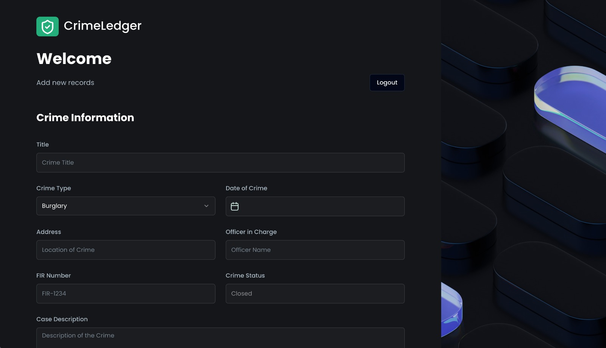

# 🔍 Crime Ledger : Crime Record Management Portal  
A secure portal for police authorities to manage crime records, ensuring transparency and preventing unauthorized modifications or deletions.

---

## 🚀 Features  
✅ Add, view, and manage detailed crime records.  
🔒 Immutable crime records to prevent tampering or deletion.  
🕵️‍♂️ Detailed suspect profiles and case descriptions.  
🔎 Search, filter, and sort crime records for efficient management.  

---

## 🛠 Technology Stack  
🎨 **Frontend:** React.js  
⚙️ **Backend:** Node.js (Express.js)  
🗄 **Database:** MongoDB  
⛓ **Blockchain/Smart Contract:** Solidity  
🌍 **Testnet:** Ethereum Sepolia  

---

## 👥 Contributors ✨  
👑 **[Utsav](https://github.com/utsavdotdev)** – Frontend  

---

## 🏛 System Overview  

The Criminal Report Management System consists of four main components:  
1️⃣ **Criminal Report Creation**  
2️⃣ **Review by Senior Officer**  
3️⃣ **Blockchain Integration**  
4️⃣ **Validation**  

---

## 📜 Process Flow  

The following diagram illustrates the entire process from report creation to validation:  

```mermaid
graph TD
    A[📝 Start] --> B[👮 Operational Officer Creates Report] 
B --> C[💾 Save Report to MongoDB] 
C --> D[🔍 Senior Officer Reviews Report] 
D --> E{✅ Approved?} 
E -->|Yes| I[🔗 Start Adding to Blockchain] 
E -->|No| G[🔄 Report will be reuploaded by Operational body] 
G --> H[🏁 End] 
 
I --> K[🔑 Hash Report Data] 
K --> M[🛡 Add Hash and MongoDB ID to Ethereum Blockchain] 

M --> H 
N[🔎 Validation Request] --> O[📂 Fetch Report from MongoDB] 
O --> P[🔢 Generate Hash of Fetched Data] 
P --> Q[🔗 Retrieve Blockchain Hash] 
Q --> R{⚖ Hashes Match?} 
R -->|Yes| S[✔ Data Validated] 
R -->|No| T[❌ Data Not Validated] 
S --> U[🏁 End] 
T --> U
```


# Local Setup Guide

## Prerequisites
- Node.js (v16+)
- npm or yarn
- Metamask browser extension
- Ethereum wallet

## Setup Steps

### 1. Alchemy RPC URL Setup
1. Go to [Alchemy](https://www.alchemy.com/)
2. Create a free account
3. Create a new app
4. Select "Ethereum" and "Sepolia" network
5. Copy the HTTP RPC URL

### 2. Metamask Installation
1. Install [Metamask browser extension](https://metamask.io/download/)
2. Create a new wallet
3. Switch to Sepolia Testnet
   - Click network dropdown
   - Select "Add Network"
   - Choose "Ethereum Sepolia"

### 3. Private Key Configuration
1. In Metamask:
   - Click account menu
   - Select "Account Details"
   - Click "Export Private Key"
   - Enter wallet password
   - Copy private key

### 4. Sepolia Testnet Ethereum
1. Use [Sepolia Faucets](https://sepoliafaucet.com/)
2. Connect Metamask wallet
3. Request test ETH
4. Confirm transaction in Metamask

### 5. Project Configuration
```bash
# Clone repository
git clone [your-repo-url]
cd [project-directory]

# Install dependencies
npm install

# Create .env file
touch .env

# Add to .env
RPC_URL=your_alchemy_rpc_url
PRIVATE_KEY=your_metamask_private_key
```

### 6. Run Project
```bash
cd smart_contract
# Compile contracts
npx hardhat compile

# Deploy to Sepolia
npx hardhat run scripts/deploy.js --network sepolia
```

## Security Notes
- Never share private key
- Use testnet for development
- Store .env in .gitignore

# After deployment
- copy the contract adress in the console
- view from sepolia blockchain explorer
- Get the mongo_uri from cloud 
- Open the .env.example of server and fill the data by creating .env file
- Do "npm run dev" in both frontend and backend


# Screenshots 
- Home page

- Operational officer report submission form



- Extra pin security for Senior officer

- Dashboard for Senior officer

